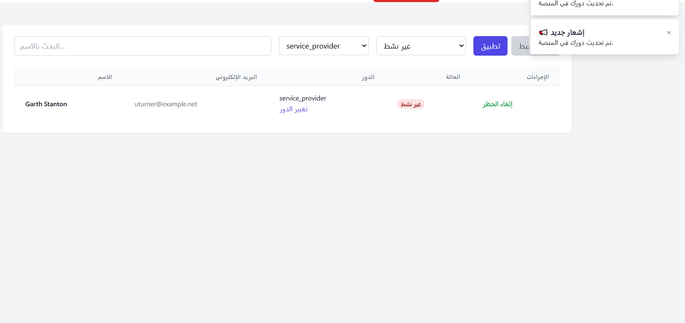

# 🛠️ Service Platform – Educational Project

A Laravel-based full-stack educational platform simulating a **services marketplace** between providers and clients. It includes a built-in **admin dashboard**, **authentication and role management**, **real-time notifications**, and support for both **Inertia.js frontend** and **external SPA frontend via REST API**.

---

## 🔥 Project Highlights

- ✅ Full **authentication** system using Laravel Breeze (Inertia) and Sanctum (for SPA)
- ✅ **Role-based access**: `admin`, `provider`, `client`
- ✅ Dual backend support:
  - Inertia-based (Laravel + Vue 3) included
  - SPA (Vue 3) via REST API supported (frontend not included)
- ✅ Real-time **WebSockets** with Laravel Echo using `laravel-websockets` (self-hosted)
- ✅ Dynamic **notifications system** (broadcast + database)
- ✅ Admin moderation panel

---

## 🧩 Tech Stack

| Layer       | Technology                           |
|------------|---------------------------------------|
| Backend     | Laravel 11, Sanctum                  |
| Frontend #1 | Vue 3 + Inertia.js (included)        |
| Frontend #2 | Vue 3 SPA via REST API (external)    |
| DB          | sqlite                           |
| Real-time   | Laravel Echo + laravel-websockets    |
| Auth        | Session-based (Inertia), Token-based (SPA) |

---

## 🔐 Roles & Access

| Role     | Access Rights                                  |
|----------|------------------------------------------------|
| Admin    | Manage all users, services, and requests       |
| Provider | Manage own services and requests               |
| Client   | View services and submit service requests      |

Access control implemented via:
- `CheckRole` middleware
- Laravel Gate & Policy (selective use)
- Auth guards with Sanctum (SPA)

---

## 📦 Features by Module

### 👤 Authentication
- Register / login with validation
- Inertia frontend: session-based
- SPA support: token-based (Sanctum)

### 🛍️ Services
- Providers can create, update, and delete services
- Public service listings
- Basic validation and error handling

### 📩 Requests
- Clients can request a service
- Providers manage requests for their own services
- Request statuses: pending, accepted, rejected, done

### 🛡️ Admin
- Block / unblock users
- View all services and requests
- Dashboard with stats (optional)

### 🔔 Notifications
- Realtime + database notifications for providers on new requests
- Toast Vue component for live feedback
- Private broadcast channels: `user.{id}`

### ⚡ Events & Listeners
- Laravel **Events** triggered on key actions (e.g. request created)
- **Listeners** handle:
  - Broadcasting
  - Triggering notifications
  - Logging or internal logic
- Fully integrated with Laravel's notification system

---

## 🔄 Real-time Features

Built using **Laravel Echo + laravel-websockets**, providers receive:
- Live notifications for incoming service requests
- Real-time UI updates in SPA (when connected)

---

## 🧪 Educational Purpose

This is a **demo-grade learning project** meant for educational use only. Ideal for:
- Practicing Laravel + Vue full-stack development
- Implementing role-based architecture
- Learning real-time broadcasting and API/SPA support

---

📎 Notes
This repo does not include the Vue SPA frontend; it only supports it via REST API.

The included frontend uses Inertia.js (tight Laravel-Vue integration).

For real-time features, ensure laravel-websockets is running and configured correctly.

---

## 📷 Preview

Below are some screenshots showcasing various parts of the platform:

|  |  |
|----------------------------------|----------------------------------|
|  |  |
|  |  |
|  |
